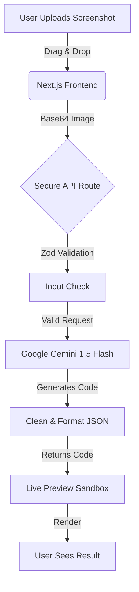

> **Turn UI screenshots into clean, production-ready HTML & Tailwind code instantly using Multimodal AI.**

## 🏗️ System Architecture

```mermaid
graph TD
    A[User Uploads Screenshot] -->|Drag & Drop| B(Next.js Frontend);
    B -->|Base64 Image| C{Secure API Route};
    C -->|Zod Validation| D[Input Check];
    D -->|Valid Request| E[Google Gemini 1.5 Flash];
    E -->|Generates Code| F[Clean & Format JSON];
    F -->|Returns Code| G[Live Preview Sandbox];
    G -->|Render| H[User Sees Result];
```
